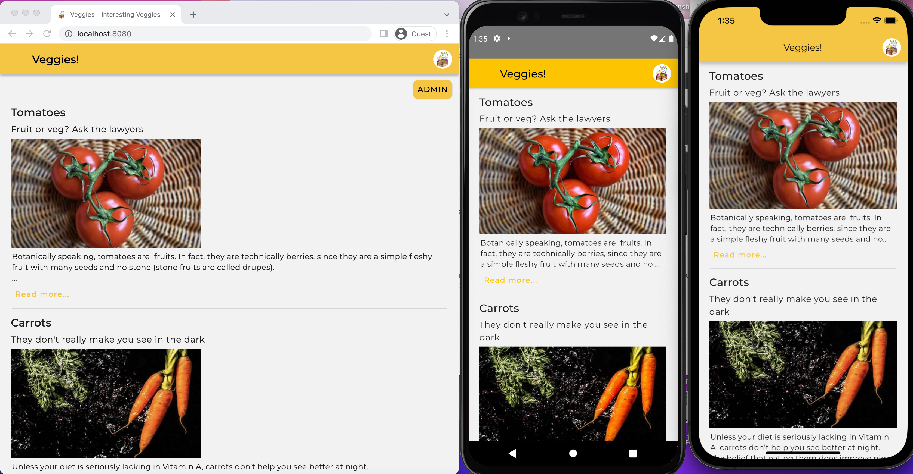

## Interesting Veggies

### Showcase React Native project

Fullstack react native app (iPhone, Android and web) I made over a weekend with both a GraphQL and a Rest API at the backend.

- Demo (uses react-native-web): https://dev.d1uzshmek9lg0p.amplifyapp.com/
- iPhone - https://apps.apple.com/us/app/interesting-veggies/id1620671791
- Android - https://play.google.com/store/apps/details?id=com.food.organic

#### Features

- React Native front-end, supports iOS, Android and web
- Back-end built with AWS Amplify, including both REST and GraphQL API's backed by a dynamoDB table containing the data
- Image storage with S3
- The REST API has a single, read-only path using a NodeJS Lambda function (Serverless ExpressJS) to handle the HTTP requests and responses to the client-facing app
- The GraphQL API is accesible through an admin API on the web app only, protected by authorization using Cognito user pools. This provides create, read, update, delete functionality.
